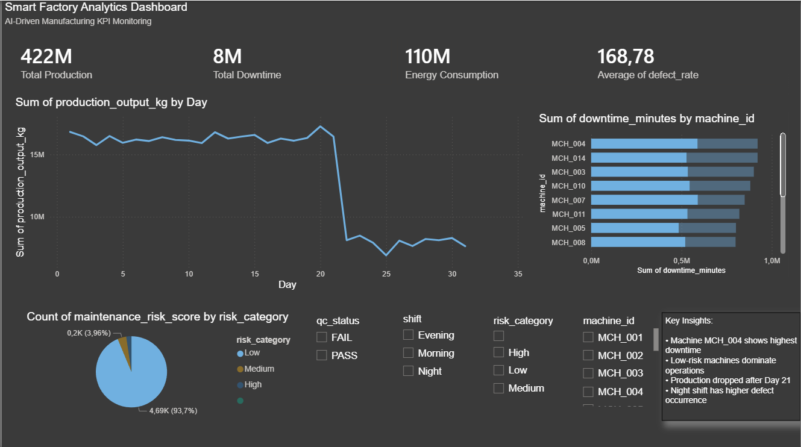

# Smart Factory Analytics Dashboard

AI-Driven Manufacturing KPI Monitoring Dashboard built using Python and Power BI.

---

## Project Overview

This project simulates a smart manufacturing factory environment and provides operational insights through interactive analytics dashboards.

The system analyzes:
- Production output
- Machine downtime
- Energy consumption
- Defect rates
- Predictive maintenance risk

The goal was to demonstrate industrial analytics and Industry 4.0 dashboard development using synthetic manufacturing data.

---

## Technologies Used

- Python
- Pandas
- NumPy
- Matplotlib
- Power BI
- GitHub

---

## Project Structure

```bash
smart-factory-ai-analytics/
│
├── Data/
│   ├── factory_data.csv
│   └── cleaned_factory_data.csv
│
├── Dashboard/
│   ├── smart_factory_dashboard.pbix
│   └── Dashboard.png
│
├── Notebooks/
│   └── analysis.ipynb
│
└── README.md
```

---

## Dashboard Features

### KPI Monitoring
- Total Production Output
- Total Downtime
- Energy Consumption
- Average Defect Rate

### Operational Analytics
- Production trend monitoring
- Machine downtime comparison
- Shift-wise filtering
- Quality control tracking

### AI Maintenance Logic
A maintenance risk score was generated using:
- vibration levels
- temperature
- downtime behavior

Machines were categorized into:
- Low Risk
- Medium Risk
- High Risk

---

## Key Insights

- Machine MCH_004 showed the highest downtime
- Low-risk machines dominated factory operations
- Production output dropped after Day 21
- Night shift showed higher defect occurrence

---

## Dashboard Preview



---

## Future Improvements

- Machine learning prediction models
- Real-time IoT integration
- Automated anomaly detection
- Cloud dashboard deployment

---

## Author

Arzoo Malhotra
# smart-factory-ai-analytics
